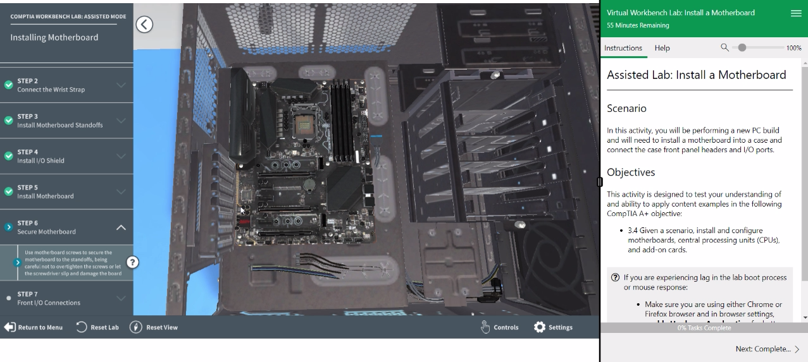

# Virtual Workbench Lab: Install a Motherboard

### [YouTube Demonstration](https://youtu.be/nDXP4oSIM7k)

## Lab Description
In this activity, you will be performing a new PC build and will need to install a motherboard into a case and connect the case front panel headers and I/O ports.

**CompTIA A+ Objective:** 
- 3.4 Given a scenario, install and configure motherboards, central processing units (CPUs), and add-on cards.

## Step-by-Step Walk-Through with Screenshots

### 1. Introduction
**Description:** Install a motherboard into a case and connect the case front panel headers and I/O ports.

**Objective:**
- Install a motherboard into a case.
- Connect the case front panel headers and I/O ports.

### 2. Preparing the Workstation

**Step 1: Gather Your Tools and Components**  
Make sure you have all the necessary tools (screwdriver, screws, etc.) and components (motherboard, case, etc.).  

**Step 2: Ensure the Workstation is Powered Off and Unplugged**  
Before starting, ensure the workstation is powered off and unplugged to avoid any electrical hazards.  

### 3. Installing the Motherboard

**Step 3: Open the Case**  
Remove the side panels of the case to access the interior. Most cases have screws at the back that need to be removed.  

**Step 4: Install the I/O Shield**  
Insert the I/O shield (the metal plate that comes with the motherboard) into the back of the case. It snaps into place.  

**Step 5: Align the Motherboard with Standoffs**  
Place the motherboard into the case, aligning it with the standoffs (pre-installed or installed manually) and the I/O shield.  

**Step 6: Secure the Motherboard**  
Use screws to secure the motherboard to the standoffs. Ensure the motherboard is firmly in place but be careful not to overtighten the screws.  

### 4. Connecting the Case Front Panel Headers and I/O Ports

**Step 7: Connect the Front Panel Headers**  
Connect the front panel headers (power switch, reset switch, power LED, HDD LED) from the case to the motherboard. Refer to the motherboard manual for the correct pin layout.  

**Step 8: Connect the Front Panel Audio and USB Ports**  
Connect the front panel audio and USB ports from the case to the appropriate headers on the motherboard.  

### 5. Verifying the Installation

**Step 9: Double-Check All Connections**  
Before closing the case, double-check all connections to ensure everything is securely connected.  

**Step 10: Close the Case**  
Replace the side panels of the case and secure them with screws.  

### 6. Conclusion

**Step 11: Power On and Test the System**  
Plug the workstation back in, power it on, and check if the system boots correctly. Ensure all front panel ports are working.  

